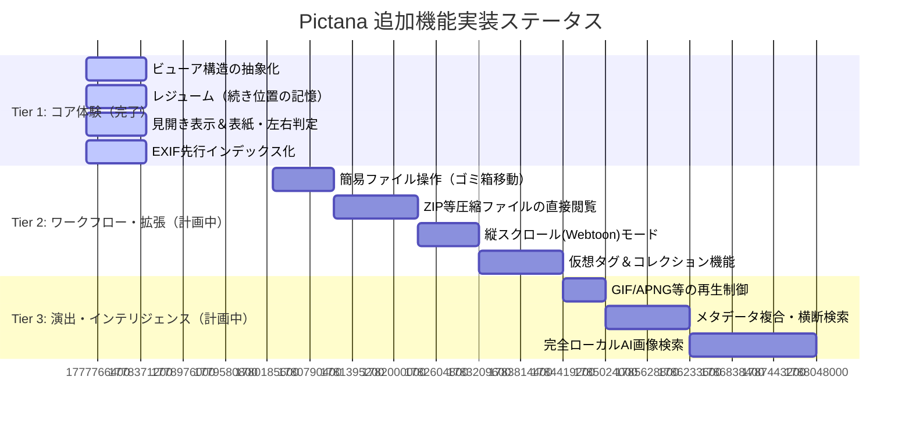

# Pictana 機能拡張ロードマップ（進捗状況反映版）

本ドキュメントは、ローカルメディアビューア「**Pictana**」のコンセプトである**「超高速ローカルビューア × 没入型読書・鑑賞体験」**の実現度に基づいたロードマップと、現在のソースコード上の**実装進捗ステータス**をまとめたドキュメントです。

---

## 1. 実装ステータス概要

現在、コアとなる鑑賞・読書機能の基盤（前回のロードマップで「Tier 1 / 最優先」と定義された機能群）は**すでに実装が完了**しています。今後は利便性の最大化や画像選別のワークフロー化、スマート検索といった拡張機能の開発フェーズへと移行します。

### ステータス分布
*   ✅ **実装完了 (4機能)**: ビューアの抽象化、レジューム機能、見開きモード、EXIF先行DBインデックス化。
*   ⏳ **開発計画中 / 未着手 (7機能)**: ゴミ箱削除、ZIP直接閲覧、Webtoonモード、仮想タグ、GIF再生制御、横断検索、ローカルAI検索。

---

## 2. 各機能の実装状況と詳細

### 【Tier 1：最優先（コンセプト必須・コア価値）】
これらが欠けると読書・鑑賞ビューアとして成立しない、プロダクトの根幹となる機能群。**すべての基盤実装が完了しています。**

#### 1. ビューア構造の抽象化
*   **ステータス:** ✅ **実装完了**
*   **提供価値:** 表示モード（通常/見開き等）の切り替えやプリロード、ズーム操作を単一のインターフェースで統一管理する。
*   **実装内容:** 
    *   [image_viewer_screen.dart](file:///d:/work/optrig/lib/presentation/screens/image_viewer_screen.dart) にて、PageControllerと詳細ビューア全体を制御する状態モデル [viewer_controller_provider.dart](file:///d:/work/optrig/lib/presentation/providers/viewer_controller_provider.dart) をバインド。
    *   表示コンテナとして [viewer_display_container.dart](file:///d:/work/optrig/lib/presentation/widgets/viewer/viewer_display_container.dart) を抽象化し、単一表示と見開き表示のレイアウト描画を完全にカプセル化。

#### 2. 閲覧の「続き位置（レジューム）」記憶
*   **ステータス:** ✅ **実装完了**
*   **提供価値:** フォルダを閉じて再度開いたときに「前回どこまで読んだか」から瞬時に再開し、ユーザーの検索ストレスを取り除く。
*   **実装内容:** 
    *   [resume_position_usecase.dart](file:///d:/work/optrig/lib/application/usecases/viewer/resume_position_usecase.dart) を定義し、表示画像変更時にバックグラウンドで [image_repository.dart](file:///d:/work/optrig/lib/domain/repositories/image_repository.dart) を経由してDriftデータベースへ `entryId` を保存。
    *   画像ビューア起動時に、前回保存されたレジューム位置を優先的に復元して初期インデックスを決定する仕組みが稼働しています。

#### 3. 見開き表示（漫画モード） ＆ 左右めくり・表紙（単一）判定
*   **ステータス:** ✅ **実装完了**
*   **提供価値:** コミックや画集を最適な2ページ配置で閲覧し、見開き時の左右ズレやめくり方向の違和感を排除する。
*   **実装内容:** 
    *   [get_viewer_pages_usecase.dart](file:///d:/work/optrig/lib/application/usecases/viewer/get_viewer_pages_usecase.dart) にてアスペクト比を動的に計算し、アスペクト比が `1.2` を超える画像は自動的に「横長（単一表示）」と判定。
    *   最初の1枚目を表紙（単一）として扱い、以降の縦長画像のみを自動で見開きペア（[double_page_viewer.dart](file:///d:/work/optrig/lib/presentation/widgets/viewer/double_page_viewer.dart)）にする高精度な論理演算を実装。RTL（右開き）/LTR（左開き）制御にも完全対応。

#### 4. EXIF先行インデックス化（DB実装）
*   **ステータス:** ✅ **実装完了**
*   **提供価値:** フォルダをスキャンした段階で非同期にEXIFメタデータを抽出し、のちのEXIF検索や位置情報プロットの際の大規模な手戻り（全再スキャン）を防ぐ。
*   **実装内容:**
    *   [index_exif_usecase.dart](file:///d:/work/optrig/lib/application/usecases/gallery/index_exif_usecase.dart) により、フォルダ内の未スキャン画像を抽出し、UIスレッドを保護するインターバル（1枚あたり50ms遅延）を入れつつ非同期でEXIFパースを実行。
    *   抽出した撮影日時、カメラ、GPS位置情報（緯度・経度）をDriftデータベースに保存。詳細ビューア内の [image_info_sheet.dart](file:///d:/work/optrig/lib/presentation/widgets/image_info_sheet.dart) から即座に確認可能です。

---

### 【Tier 2：優先（体験の完成度向上・実用性の拡大）】
ユーザーのローカル画像整理・選別ワークフローを完結させ、対応メディアの幅を広げるための拡張機能群。**これらは現在、開発計画中（未着手）です。**

#### 5. 簡易ファイル操作（ゴミ箱への移動 / 削除）
*   **ステータス:** ⏳ **開発計画中 / 未着手**
*   **提供価値:** ビューアで画像を大きく確認しながら、不要なものをその場でゴミ箱へ送る。エクスプローラー往復の摩擦をなくす。
*   **今後の開発方針:** WindowsのShell API（ごみ箱移動）およびAndroid SAFのドキュメント削除APIをInfrastructure層で抽象化し、ドメインRepositoryインターフェースから呼び出せるように実装します。

#### 6. 圧縮ファイル（ZIP/RAR/7zなど）の直接解凍閲覧機能
*   **ステータス:** ⏳ **開発計画中 / 未着手**
*   **提供価値:** ローカルに圧縮された状態で保存されたコミック等を、解凍のオーバーヘッドなく即座にドラッグ＆ドロップで開く。
*   **今後の開発方針:** `archive` 等の圧縮解凍ライブラリを利用し、Isolate内でZIP等のエントリー情報を読み込み、サムネイル用の画像のみをオンデマンドで部分解凍してDBに登録するストリーミングインデックス機構を実装します。

#### 7. 縦スクロール（Webtoon）モード ＆ 連結表示
*   **ステータス:** ⏳ **開発計画中 / 未着手**
*   **提供価値:** スマートフォン等における縦スクロールマンガ（Webtoon）を、ページの区切り目を感じさせることなく縦長に連結して表示。
*   **今後の開発方針:** 抽象化されたビューア基盤（`ViewerDisplayContainer`）に `vertical` モードを追加。`ListView.builder` にて画像のロード位置を監視し、シームレスな連続スクロール描画と先読み制御を行います。

#### 8. 仮想タグ ＆ コレクション（プレイリスト）機能
*   **ステータス:** ⏳ **開発計画中 / 未着手**
*   **提供価値:** 実ファイルシステム構造を変更せずに、アプリ内で「お気に入り」「イラスト参考」などの仮想タグやセットを作成し、整理・鑑賞する。
*   **今後の開発方針:** Driftデータベースに `Tags`, `Collections`, `EntryTags`（中間マッピングテーブル）を追加し、タグ付与およびフィルタ用のUI/UXをプレゼンテーション層に追加します。

---

### 【Tier 3：準優先（付加価値の磨き込み・未来の体験）】
スマート検索やアニメーションの確認作業など、特定のユースケースや未来の快適な探索を強化する機能群。**これらは現在、開発計画中（未着手）です。**

#### 9. アニメーションGIF/APNG等の再生制御
*   **ステータス:** ⏳ **開発計画中 / 未着手**
*   **提供価値:** アニメーション画像を確認する際、自動ループだけでなく、一時停止やコマ送り、特定の秒数へのシークによるディテール鑑賞を可能にする。
*   **今後の開発方針:** Flutterの `GifController` やカスタムデコーダーを用いて、GIF等の各フレームインデックスを制御し、ビューアの下部にシークバーおよび再生・一時停止・フレーム戻し/送りのUIをバインドします。

#### 10. メタデータ複合・横断検索
*   **ステータス:** ⏳ **開発計画中 / 未着手**
*   **提供価値:** フォルダを跨いで、「2025年撮影」「タグ：自然」「カメラ：Sony」といった複数のメタデータを組み合わせた超高速検索を実現する。
*   **今後の開発方針:** すでに実装済みのEXIFインデックスや、今後実装予定の仮想タグテーブルをDriftで内部結合（JOIN）し、インクリメンタルかつマルチパラメータに対応した検索エンジンを実装します。

#### 11. 完全ローカル動作のAI自然言語検索（Embeddingによる検索）
*   **ステータス:** ⏳ **開発計画中 / 未着手**
*   **提供価値:** クラウドへ画像を一切送らず、ローカルの安全な環境で「赤い夕焼け」「笑っている犬」といった自然言語クエリから数万枚の画像を瞬時に引き出す。
*   **今後の開発方針:** 軽量なCLIP（Visual/Text）などの事前学習モデルをONNX形式でWindows/Android内にローカル統合。フォルダスキャン時のバックグラウンドで画像の特徴ベクトルをDB（Drift/SQLiteのVector拡張またはカスタムベクトルテーブル）に記録し、検索実行時にクエリベクトルとのコサイン類似度でソート表示させます。
